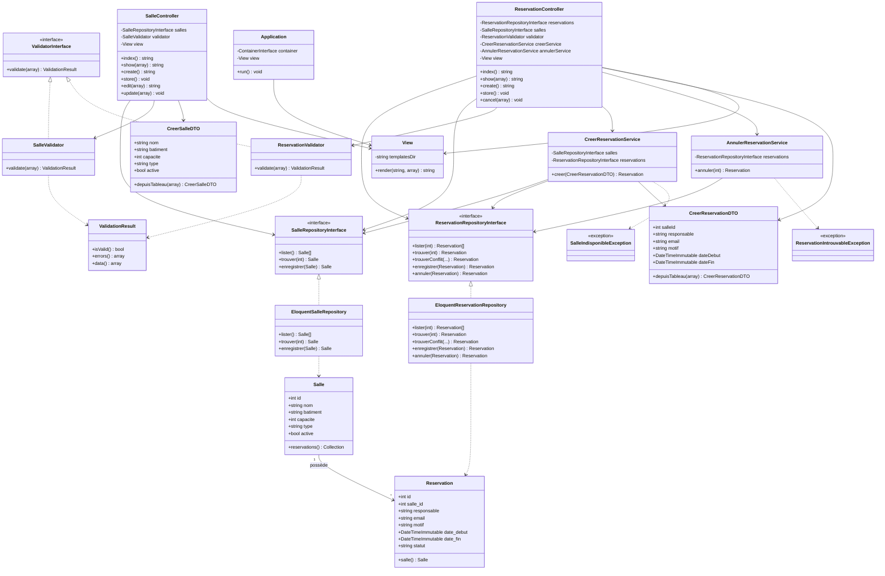

# Diagramme de classes

```mermaid
classDiagram
    class Salle {
        +int id
        +string nom
        +string batiment
        +int capacite
        +string type
        +bool active
        +reservations() Collection
    }

    class Reservation {
        +int id
        +int salle_id
        +string responsable
        +string email
        +string motif
        +DateTimeImmutable date_debut
        +DateTimeImmutable date_fin
        +string statut
        +salle() Salle
    }

    Salle "1" --> "*" Reservation : possède

    class CreerSalleDTO {
        +string nom
        +string batiment
        +int capacite
        +string type
        +bool active
        +depuisTableau(array) CreerSalleDTO
    }

    class CreerReservationDTO {
        +int salleId
        +string responsable
        +string email
        +string motif
        +DateTimeImmutable dateDebut
        +DateTimeImmutable dateFin
        +depuisTableau(array) CreerReservationDTO
    }

    class ValidatorInterface {
        <<interface>>
        +validate(array) ValidationResult
    }

    class ValidationResult {
        +isValid() bool
        +errors() array
        +data() array
    }

    class SalleValidator {
        +validate(array) ValidationResult
    }

    class ReservationValidator {
        +validate(array) ValidationResult
    }

    ValidatorInterface <|.. SalleValidator
    ValidatorInterface <|.. ReservationValidator
    SalleValidator ..> ValidationResult
    ReservationValidator ..> ValidationResult

    class SalleRepositoryInterface {
        <<interface>>
        +lister() Salle[]
        +trouver(int) Salle
        +enregistrer(Salle) Salle
    }

    class ReservationRepositoryInterface {
        <<interface>>
        +lister(int) Reservation[]
        +trouver(int) Reservation
        +trouverConflit(...) Reservation
        +enregistrer(Reservation) Reservation
        +annuler(Reservation) Reservation
    }

    class EloquentSalleRepository {
        +lister() Salle[]
        +trouver(int) Salle
        +enregistrer(Salle) Salle
    }

    class EloquentReservationRepository {
        +lister(int) Reservation[]
        +trouver(int) Reservation
        +trouverConflit(...) Reservation
        +enregistrer(Reservation) Reservation
        +annuler(Reservation) Reservation
    }

    SalleRepositoryInterface <|.. EloquentSalleRepository
    ReservationRepositoryInterface <|.. EloquentReservationRepository
    EloquentSalleRepository ..> Salle
    EloquentReservationRepository ..> Reservation

    class CreerReservationService {
        -SalleRepositoryInterface salles
        -ReservationRepositoryInterface reservations
        +creer(CreerReservationDTO) Reservation
    }

    class AnnulerReservationService {
        -ReservationRepositoryInterface reservations
        +annuler(int) Reservation
    }

    CreerReservationService --> SalleRepositoryInterface
    CreerReservationService --> ReservationRepositoryInterface
    CreerReservationService --> CreerReservationDTO
    CreerReservationService ..> SalleIndisponibleException
    AnnulerReservationService --> ReservationRepositoryInterface
    AnnulerReservationService ..> ReservationIntrouvableException

    class SalleIndisponibleException {
        <<exception>>
    }

    class ReservationIntrouvableException {
        <<exception>>
    }

    class SalleController {
        -SalleRepositoryInterface salles
        -SalleValidator validator
        -View view
        +index() string
        +show(array) string
        +create() string
        +store() void
        +edit(array) string
        +update(array) void
    }

    class ReservationController {
        -ReservationRepositoryInterface reservations
        -SalleRepositoryInterface salles
        -ReservationValidator validator
        -CreerReservationService creerService
        -AnnulerReservationService annulerService
        -View view
        +index() string
        +show(array) string
        +create() string
        +store() void
        +cancel(array) void
    }

    SalleController --> SalleRepositoryInterface
    SalleController --> SalleValidator
    SalleController --> CreerSalleDTO
    ReservationController --> ReservationRepositoryInterface
    ReservationController --> SalleRepositoryInterface
    ReservationController --> ReservationValidator
    ReservationController --> CreerReservationService
    ReservationController --> AnnulerReservationService
    ReservationController --> CreerReservationDTO

    class View {
        -string templatesDir
        +render(string, array) string
    }

    class Application {
        -ContainerInterface container
        -View view
        +run() void
    }

    Application --> View
    SalleController --> View
    ReservationController --> View
```
